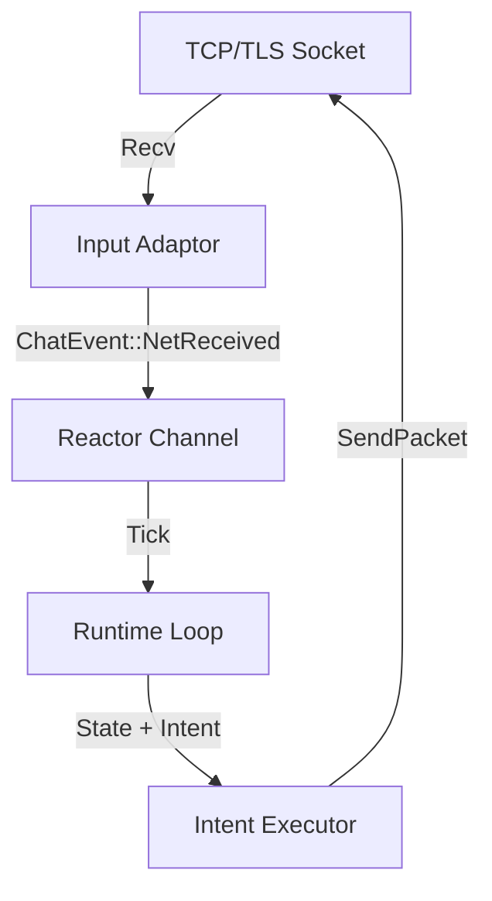

# Aleph Architecture: Design Update
**Date:** 2026-02-10
**Status:** Implementation

## 1. Overview
We have successfully pivoted `hs-io-uring` to the **Aleph Architecture**, a Replay-First, Event-Sourced model inspired by Quake III's networking and deterministic simulation principles. The system treats "Live" execution as a special case of "Replay".

## 2. Core Components

### 2.1 The Truth (EventStream)
*   **Module:** `System.IO.EventStream`
*   **Concept:** An immutable, append-only log of all external inputs.
*   **Format:** Binary-encoded `Entry` records (SequenceID, Timestamp, Checksum, Payload).
*   **Persistence:** `System.IO.EventStream.Journal` implements a `FileJournal` that frames messages on disk.

### 2.2 The Logic (Reactor)
*   **Module:** `System.IO.Reactor`
*   **Concept:** A Pure Function `(State, Event) -> (State, [Intent])`.
*   **Constraints:** Zero IO, Zero Time, Zero Randomness.
*   **Chat Logic:** `Chat.Logic` implements this interface for the chat application.

### 2.3 The Runtime (Engine)
*   **Module:** `System.IO.Runtime`
*   **Concept:** The "Game Loop".
*   **Replay Mode:** Reads from Journal -> Feeds Reactor -> Ignores Intents -> Restores State.
*   **Live Mode:** Polls Input (Tick) -> Appends to Journal -> Feeds Reactor -> Executes Intents.

## 3. Network Integration (The "Gateway")

To make the system useful, we must bridge the Pure Reactor to the messy physical network.

### 3.1 Architecture
The Network Layer acts as a bidirectional translation layer:

### 3.2 Components
1.  **Network Context:** A thread-safe handle to the active connection (Socket + Locks).
2.  **Input Pump (Thread):** A dedicated `forkIO` thread that performs blocking reads on the socket, wraps bytes in `NetReceived`, and writes to `reactorChan`.
3.  **Output Executor:** The `executeIntent` function in the Runtime loop uses the Network Context to perform blocking writes.

### 3.3 Failure Handling
*   **Connection Loss:** The Input Pump detects EOF/Error, pushes `NetError` event to Journal.
*   **Reconnection:** The Logic decides if/when to reconnect (via new Intent), or the Runtime handles it (Policy). For v1, we treat disconnection as terminal or manual retry.

## 4. Future Roadmap
*   **Checksum Verification:** Implement CRC32 in `EventStream`.
*   **Snapshotting:** Implement periodic state snapshots to speed up replay.
*   **io_uring Integration:** Replace the `forkIO` Input Pump with native `io_uring` SQ/CQ polling for massive scalability.
